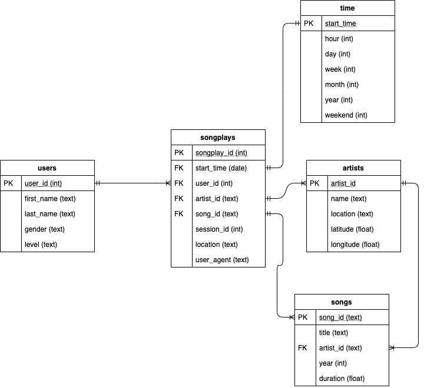

### Project goals:
- Build the database schema
- Write the SQL queries in file 'sql_queries.py'
- Build the database and create tables by running 'create_tables.py'
- Build the ETL process in files 'etl.ipynb' and 'etl.py'
- Run 'etl.py' to transfer all the data from the JSON format to our new Postgres database.

### Database schema:
The data given in the insturctions page states that the Sparkify database has the following tables:
- songplays - records in log data associated with song plays. (songplay_id, start_time, user_id, level, song_id, artist_id, session_id, location, user_agent)
- users - users in the app (user_id, first_name, last_name, gender, level)
- songs - songs in music database (song_id, title, artist_id, year, duration)
- artists - artists in music database (artist_id, name, location, latitude, longitude)
- time - timestamps of records in songplays broken down into specific units (start_time, hour, day, week, month, year, weekday)

The database schema and datatypes are illustrated in the ERD diagram below:

